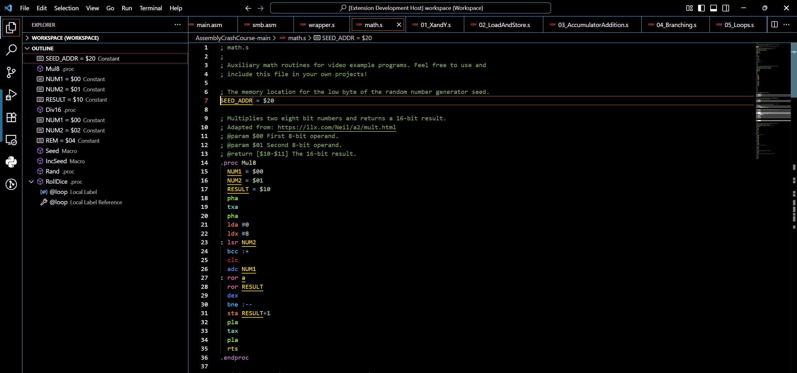
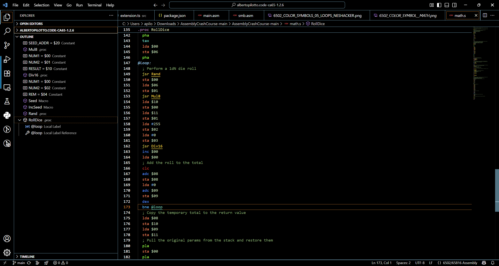
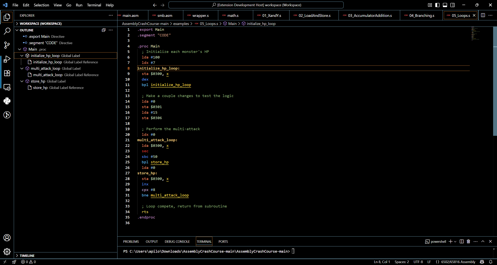
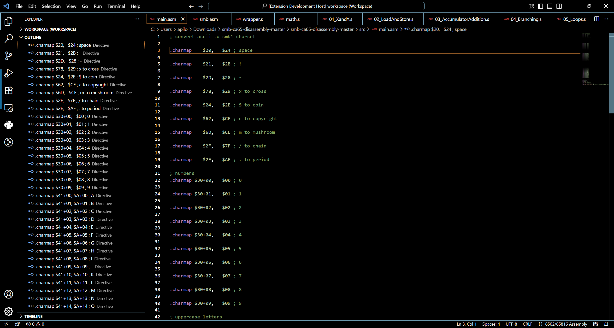
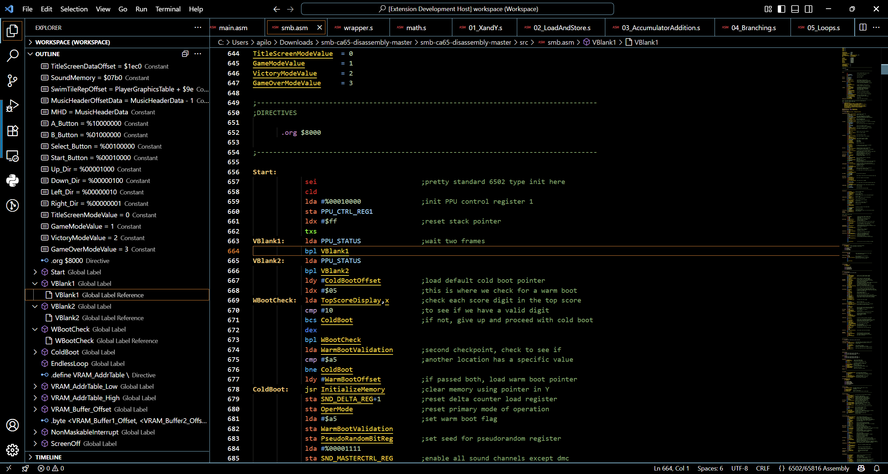
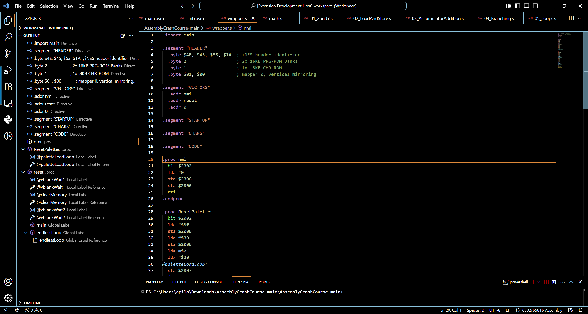
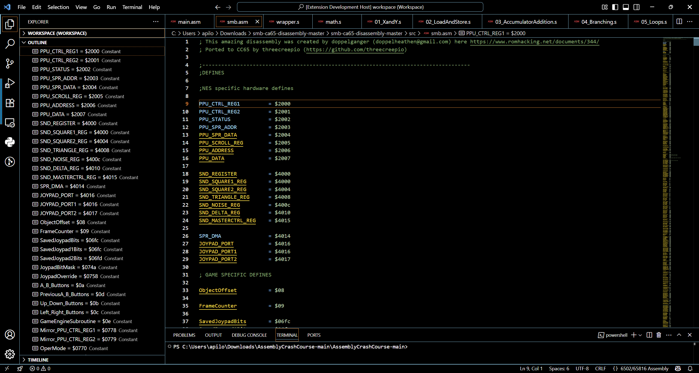

# ca65 Macro Assembler Language Support (6502/65816)

This extension provides syntax highlighting and problem matchers for use with the [ca65 6502/65816 Macro Assembler](https://www.cc65.org/doc/ca65.html).

## Features

All 6502, 65816, and variant opcodes are supported by the syntax highlighter, as well as all ca65 pseudovariables, control commands, operators, and literals.


### Example Images

Below are examples of syntax highlighting and Outliner highlighting:


*6502 Color Symbol Math*


*6502 Color Symbol Math Local Loop Label Reference*


*6502 Color Symbols Loops NES Hacker*


*6502 Color Symbols SMB Charmap*


*6502 Color Symbols Super Mario Bros 1985*


*6502 Color Syntax Wrapper*


*6502 Mario Defines Constants*

This extension automatically registers build tasks for 6502 and 65816 assembly files which invoke `cl65` on the file currently being edited. If you have one or more [memory map configuration
files](https://www.cc65.org/doc/ld65-5.html) in your workspace folder with the `.cfg` extension, a task will be created for each of them in addition to the default task, which does not specify a configuration file.

You can also create a file in the root of your workspace called `cl65config.json`. This allows you to optionally specify the name of the input file which is passed to the assembler as well as any additional parameters. Optionally, you can also specify the location of the `cl65` executable itself, if it isn't available on your `PATH`.

```json
{
    "executable": "C:\\tools\\cl65.exe",
    "input": "main.asm",
    "params": "--verbose"
}
```

If you want to create custom build tasks, this extension contributes the following problem matchers:

* `cl65`
* `ld65`

You can use these problem matchers in `task.json` using the normal syntax.

```json
{
    "version": "2.0.0",
    "tasks": [
        {
            "label": "ca65: Compile and Link Current File",
            "group": "build",
            "type": "shell",
            "command": "cl65 ${file}",
            "problemMatcher": ["$ca65", "$ld65"]
        }
    ]
}
```

## Using tasks.json for Compilation

To ensure other users can compile the project easily, include a `tasks.json` file in the `.vscode` folder of your workspace. This file defines tasks for building and running the project.

Here is an example `tasks.json` configuration:

```json
{
    "version": "2.0.0",
    "tasks": [
        {
            "label": "Compile TypeScript",
            "type": "shell",
            "command": "npx tsc",
            "group": "build",
            "problemMatcher": ["$tsc"]
        }
    ]
}
```

This configuration ensures that TypeScript files are compiled into JavaScript and output to the `out` directory. Users can run this task by selecting it in the VS Code Task Runner.

## Switch to CA65-ASM-Color Theme

To experience the color changes provided by this extension, switch your theme to 'CA65-ASM-Color' immediately after installation. You can do this by navigating to `File > Preferences > Theme > Color Theme` or using the `Preferences: Color Theme` command (`Ctrl+K Ctrl+T`).


## Release Notes

### 1.2.6

Fixed a bug preventing comments from being recognized immediately following a blockstart.
Updated tasks.json to remove references to unused problem matchers (thanks to @ianbestGV).

### 1.2.5

Reworked problem matchers.

### 1.2.4

Fixed a bug preventing the char constants `'` and `\` from being parsed correctly.
Fixed a bug relating to the ordering of the CLI options passed to `ca65`.

### 1.2.3

Added support for the `executable` parameter in `cl65config.json`.

### 1.2.2

Added support for .inc files.

### 1.2.1

Added support for .fatal, .definedmacro, .undef, .undefine.

### 1.2.0

Added support for block comments.
Added support for .endrepeat.
Updated packages.

### 1.1.0

Added autodetected build tasks.
Added support for cl65config.json.

### 1.0.0

Initial release of code-ca65.

## Building/Packing Instructions

Make sure you have Node.js installed. Then run:

```npm install -g vsce```

You can use `vsce` to package the extension by running it within the repository directory:

```vsce package```
